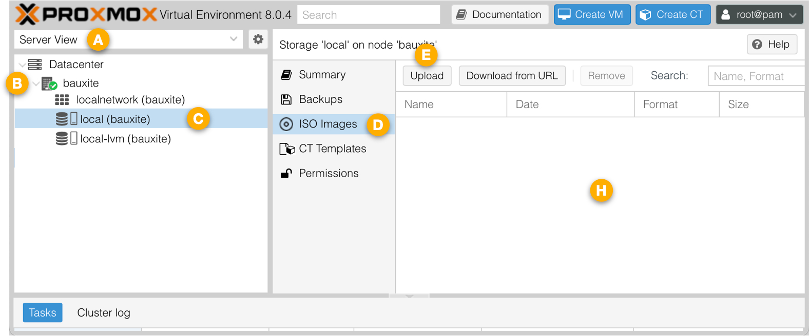
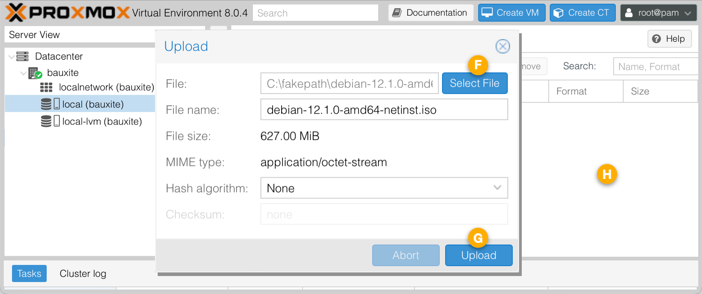
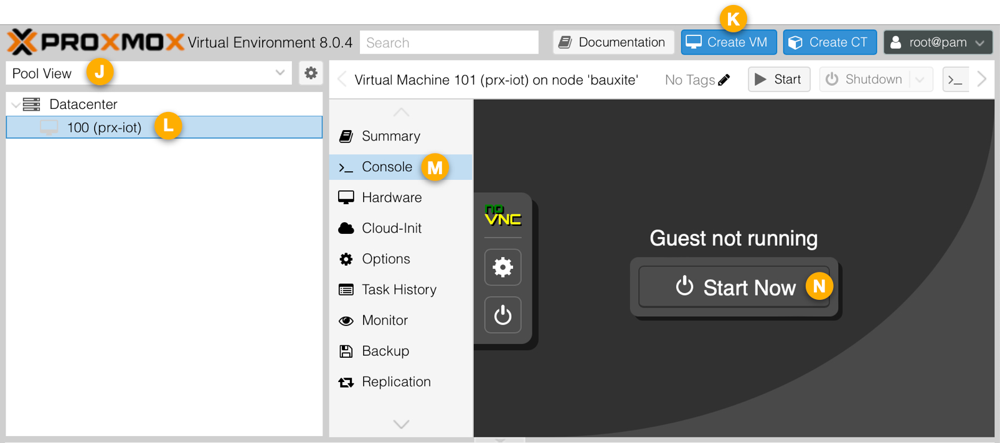

# Proxmox VE + PiBuilder + IOTstack

This tutorial walks you through the process of installing a Debian Bookworm guest system on a Proxmox&nbsp;VE instance, and then using PiBuilder to construct a platform for IOTstack.

## contents

- [Assumptions](#assumptions)
- [Definitions](#definitions)
- [Phase 1 - get installation media](#phaseGetISO)
- [Phase 2 - construct Debian guest](#phaseConstructGuest)
- [Phase 3 - guest user configuration](#phaseGuestConfig)
- [Phase 4 - clone PiBuilder](#phaseClonePiBuilder)
- [Phase 5 - run PiBuilder scripts](#phaseRunPiBuilder)

	- [Script 01](#runScript01)
	- [Script 02](#runScript02)
	- [Script 03](#runScript03)
	- [Script 04](#runScript04)
	- [Script 05](#runScript05)

- [Phase 6 - IOTstack is ready](#phaseRunIOTstack)
- [Home Assistant (Supervised)](#hassio)

<a name="assumptions"></a>
## Assumptions

1. Your hardware platform meets the Proxmox [minimum system requirements](https://www.proxmox.com/en/proxmox-virtual-environment/requirements).
2. You have already [downloaded](https://www.proxmox.com/en/downloads) and installed Proxmox&nbsp;VE on your platform.
3. You are able to use a web browser to connect to the Proxmox&nbsp;VE GUI on port 8086.
4. You are able to login to the Proxmox&nbsp;VE GUI as root.

<a name="definitions"></a>
## Definitions

Wherever you see any «guillemot» delimited placeholders in these instructions, replace the entire placeholder (including the guillemots) with its actual value:

* *placeholder for your Proxmox&nbsp;VE instance:*

	- `«proxmox_root_password»` = the password set for the root user during the installation of the instance.

* *placeholders for your guest system:*

	- `«guest_host»` = the host name given to the guest system (eg `prx-iot`).
	- `«guest_user»` = the account name of the ordinary user set during the installation of the guest (eg `alan`).
	- `«guest_user_password»` = the password for `«guest_user»`.

<a name="phaseGetISO"></a>
## Phase 1 - get installation media

This phase walks you through the process of downloading the installation media for Debian. You only need to complete the steps in this phase once. You will be able to construct any number of Debian Guest systems from the same installation media.

1. Use your web browser to open [https://www.debian.org](https://www.debian.org).
2. Click "Download". Your browser should begin downloading the latest Debian installer onto your support host (Linux, macOS, Windows). The file will have a name like `debian-12.1.0-amd64-netinst.iso`. This is generally referred to as *an `.iso`,* indicating that the file is in ISO9660 (Optical Disc) format. 
7. Use your web browser to:

	* Connect to your Proxmox&nbsp;VE instance on port 8006
	* Login as root

	Then. by reference to the screen-shot below:

	

	* Select the "Server View" <mark>A</mark>
	* Select your server by name <mark>B</mark> (the server in this example is named "bauxite")
	* If the hierarchy is not expanded, expand it by clicking the &#xFE65; so it turns into &#x22C1; 
	* Select the "local" storage option <mark>C</mark>
	* Select the "ISO Images" grouping <mark>D</mark>
	* Click the "Upload" button <mark>E</mark>

	In the file selection dialog that opens:
	
	
	
	* Click the "Select File" button <mark>F</mark>
	* Use the file picker to select the `.iso` you downloaded from [https://www.debian.org](https://www.debian.org).

		> Ignore the `C:\fakepath` in the dialog

	* Click the "Upload" button <mark>G</mark>
	* The uploaded file will appear in the list <mark>H</mark>.

<a name="phaseConstructGuest"></a>
## Phase 2 - construct Debian guest

This phase walks you through the process of creating a Debian guest system. You can construct any number of Debian Guest systems from the installation media downloaded in the [previous phase](#phaseGetISO).



1. Use your web browser to:

	* Connect to your Proxmox&nbsp;VE instance on port 8006
	* Login as root
	* Select the "Pool View" <mark>J</mark>
	* Click "Create VM" <mark>K</mark>

	> Ignore reference points <mark>L</mark>, <mark>M</mark> and <mark>N</mark>; we will come to those later. 

2. In the "Create Virtual Machine" dialog, work through the tabs in order, clicking <kbd>Continue</kbd> at the end of each:

	* "General" tab:

		- <a name="setGuestName"></a>"Name" field: enter a name for your guest (eg "prx-iot")

	* "OS" tab:

		- "ISO image" popup menu: select `debian-12.1.0-amd64-netinst.iso`

		This is the image you downloaded in the [previous phase](#phaseGetISO).

	* "System" tab:

		- "Qemu Agent" checkbox: enable.

	* "Disks" tab:

		- "Disk size (GiB)" field: the default is 32GB which is usually sufficient but you can adjust it as you see fit.
		- "Discard" checkbox: enable this if your underlying physical storage media is a Solid State Disk (SSD).

	* "CPU" tab:

		- "Cores" field: this defaults to a single core. At least two cores are recommended.

	* "Memory" tab:

		- "Memory (MiB)" field: this defaults to 2048MB. At least 4096MB is recommended.

	* "Network" tab:

		- accept all defaults

	* "Confirm" tab:

		- Click <kbd>Finish</kbd>

3. Click the newly-created guest <mark>L</mark> to select it.
4. Click the "Console" <mark>M</mark> to select the guest's console.
5. Click the "Start Now" button <mark>N</mark>.
6. The guest will boot from the installation `.iso`:

	* Choose "Graphical install" and press <kbd>return</kbd>
	* Respond as appropriate to the screens:

		* "Select a language"
		* "Select your location"
		* "Configure the keyboard". Here's a tip from Andreas Spiess:

			> Correct selection of your keyboard is **essential**. Otherwise, password entry might not work as you expect. For example, the German keyboard has <kbd>Y</kbd> and <kbd>Z</kbd> switched. You do not see your password as you type so you think it contains a Y but it's actually a Z.

	* "Configure the network":

		* <a name="setHostName"></a>At "Please enter the host name for this system", choose an appropriate name for this virtual `«guest_host»`.

			Notes:

			1. Your DHCP server may suggest a host name but you will almost certainly want to change it.
			2. You can use letters (all lower case by convention), digits and dashes. For example "prx-iot".
			3. The name you choose here can be the *same* as the one you chose in the [General](#setGuestName) tab of the Create Virtual Machine dialog, or it can be *different*.
			4. The name you choose **here** is the name by which your guest system will be known. For example, if you choose "prx-iot" then the `$HOSTNAME` variable of your guest will be `prx-iot` and the guest system will be reachable via the multicast DNS name of `prx-iot.local`.

		* At "Domain name", enter a domain name (if appropriate) or leave it blank.

			> Your DHCP server may suggest a domain name.

	* "Set up users and passwords":

		* <a name="noRootPassword"></a>**Leave both root password fields empty**.

			> If you do not assign a root password then the user you create in the next step will be given the ability to run `sudo`. This is similar to the privileges given to the default `pi` user on a Raspberry Pi. These instructions assume you accept this advice.

		* <a name="setFullUserName"></a>At "Full name for the new user", enter the full (long) username for `«guest_user»` (eg "Alan Turing").
		* <a name="setShortUserName"></a>At "Username for your account", either accept the default or enter a (short) username for `«guest_user»` (eg "alan").
		* At "Choose a password for the new user", set and confirm a `«guest_user_password»`.

	* "Configure the clock":

		* At "Select the state or province to set your timezone", make an appropriate choice.

	* "Partition Disks":

		* At "Partitioning method", choose "Guided - use entire disk".
		* At "Select disk to partition", accept the default.
		* At "Partitioning scheme", accept the recommendation of all files in one partition.
		* Leave "Finish partitioning and write changes to disk" selected.
		* At "Write the changes to disks?", select "yes".

7. The installer will copy the base system from the `.iso` to the allocated (virtual) partition.
8. At "Scan extra installation media?", leave the default at "No".
9. "Configure the package manager":

	* "Debian archive mirror country", select a nearby mirror.
	* "Debian archive mirror", either accept the default or select an appropriate alternative.
	* If you need to set up a proxy, enter the details; otherwise leave the field blank.

10. Respond to the "popularity contest" question as you think appropriate.
11. At "Software selection":

	- enable "SSH server".
	- choose desktop environments as you prefer.

	Note:

	* Enabling SSH is **important.** Please do not skip this step.

12. The installer will install your selected software.
13. "Install the GRUB boot loader":

	- At "Install the GRUB boot loader to your primary drive?", accept "Yes" (the default).
	- At "Device for boot loader installation", select `/dev/sda`.

14. At "Installation complete", ignore the reminder to remove the installation media. Proxmox&nbsp;VE handles this automatically.
15. Your system will reboot. There is no need to respond to any of the boot-time prompts. Eventually, you will see a screen containing the full username you set [earlier](#setFullUserName).

<a name="phaseGuestConfig"></a>
## Phase 3 - guest user configuration

A limitation of the Proxmox&nbsp;VE console window for a guest is that copy and paste doesn't work. Although it is possible to configure guests to support copy and paste in the console, it's simpler to use SSH.

Note:

* You can't use SSH to login to the `«guest_host»` as root. You must connect using the `«guest_user»` username.

Open a Terminal window on your support host (eg your Mac/PC). From the Terminal window:

1. Ensure your SSH "known hosts" file is in a predictable state:

	``` console
	$ ssh-keygen -R «guest_host».local
	```

	You may get an error from this command. That's OK. It's simply a protective measure.

2. Login to the guest system:

	``` console
	$ ssh -4 «guest_user»@«guest_host».local
	```

	You should expect to see the "trust on first use" (aka TOFU) challenge ("The authenticity of host … can't be established"). Respond with "yes" and press <kbd>return</kbd>.

	Supply the `«guest_user_password»` when prompted.

3. Confirm that you can execute commands using `sudo`:

	``` console
	$ sudo echo "hello"
	```

	Supply the `«guest_user_password»` when prompted.
	
	Note:
	
	* If you are not able to execute commands using `sudo`, it probably means that you set a password for the root user, even though the [instructions](#noRootPassword) advised against doing that. Your best course of action is to destroy this guest system and start again.

4. Run the following commands, one at a time:

	``` console
	$ sudo apt update ; sudo apt install -y git
	$ echo "$USER  ALL=(ALL) NOPASSWD:ALL" | sudo tee -a "/etc/sudoers.d/$USER" >/dev/null
	$ sudo usermod -G adm -a $USER
	$ exit
	```

	Explanation:

	1. The first line installs `git`.
	2. The second line gives the current user the ability to execute `sudo` commands without needing a password.
	3. The third line adds the current user to the `adm` group (administration).
	4. The `exit` command is the same as typing <kbd>control</kbd>+<kbd>d</kbd>. Logging-out from the `«guest_user»` account is required before the privilege changes can take effect.
 
 	After the next login, `«guest_user»` will have exactly the same privileges as the default `pi` user on a Raspberry Pi and, in particular, the ability to run `sudo` commands without a password prompt.

<a name="phaseClonePiBuilder"></a>
## Phase 4 - clone PiBuilder

1. Login to the guest system:

	``` console
	$ ssh -4 «guest_user»@«guest_host».local
	```

	Supply the `«guest_user_password»` when prompted.

2. Verify that the user has the ability to run `sudo` **without** a password:

	``` console
	$ sudo echo "hello"
	```

	> If you are prompted for a password to run the `sudo` command, go back to the [previous phase](#phaseGuestConfig) and check your work.

3. Clone PiBuilder:

	``` console
	$ git clone https://github.com/Paraphraser/PiBuilder.git ~/PiBuilder
	```

	> If you have customised a clone of PiBuilder which you want to use rather than the version on GitHub, adapt the URL appropriately.

4. Logout (<kbd>control</kbd>+<kbd>d</kbd>).

Tip:

* If you wish to use Proxmox's facilities to take a snapshot of your guest OS before you start running the PiBuilder scripts, this is the place to do it.

<a name="phaseRunPiBuilder"></a>
## Phase 5 - run PiBuilder scripts

<a name="runScript01"></a>
### Script 01

1. Login to the guest:

	``` console
	$ ssh -4 «guest_user»@«guest_host».local
	```

2. Run the first script:

	``` console
	$ ./PiBuilder/boot/scripts/01_setup.sh
	```

	There is no need to pass the `«guest_host»` argument to this script. You already entered the name for this host at ["Please enter the host name for this system"](#setHostName).

<a name="runScript02"></a>
### Script 02

1. Login to the guest:

	``` console
	$ ssh -4 «guest_user»@«guest_host».local
	```

2. Run the second script:

	``` console
	$ ./PiBuilder/boot/scripts/02_setup.sh
	```

<a name="runScript03"></a>
### Script 03

1. Login to the guest:

	``` console
	$ ssh «guest_user»@«guest_host».local
	```

	> The previous 02 script disabled IPv6 so there is no further need to use the `-4` option.

2. Run the third script:

	``` console
	$ ./PiBuilder/boot/scripts/03_setup.sh
	```

<a name="runScript04"></a>
### Script 04

1. Login to the guest:

	``` console
	$ ssh «guest_user»@«guest_host».local
	```

2. Run the fourth script:

	``` console
	$ ./PiBuilder/boot/scripts/04_setup.sh
	```

<a name="runScript05"></a>
### Script 05

1. Login to the guest:

	``` console
	$ ssh «guest_user»@«guest_host».local
	```

2. Run the fifth script:

	``` console
	$ ./PiBuilder/boot/scripts/05_setup.sh
	```

Tip:

* If you wish to use Proxmox's facilities to take a snapshot of your guest OS before you start doing anything with IOTstack, this is the place to do it.

<a name="phaseRunIOTstack"></a>
## Phase 6 - IOTstack is ready

1. Login to the guest:

	``` console
	$ ssh «guest_user»@«guest_host».local
	```

2. The system is now ready for IOTstack. You can:

	* EITHER restore a backup:

		``` console
		$ iotstack_restore «runtag»
		```

		Note:

		* Your ability to run `iotstack_restore` depends on having set up two files:

			- `~/.config/iotstack_backup/config.yml`
			- `~/.config/rclone/rclone.conf`

			If you did not configure PiBuilder to do that for you, you will have to copy those two files into place now.

	* OR launch the menu like this:

		``` console
		$ cd ~/IOTstack
		$ ./menu.sh
		```

<a name="hassio"></a>
## Home Assistant (Supervised)

If you wish to install Home Assistant on the same Proxmox&nbsp;VE instance, follow the instructions [here](https://community.home-assistant.io/t/installing-home-assistant-os-using-proxmox-8/201835#section-3-installing-home-assistant-os-4).
